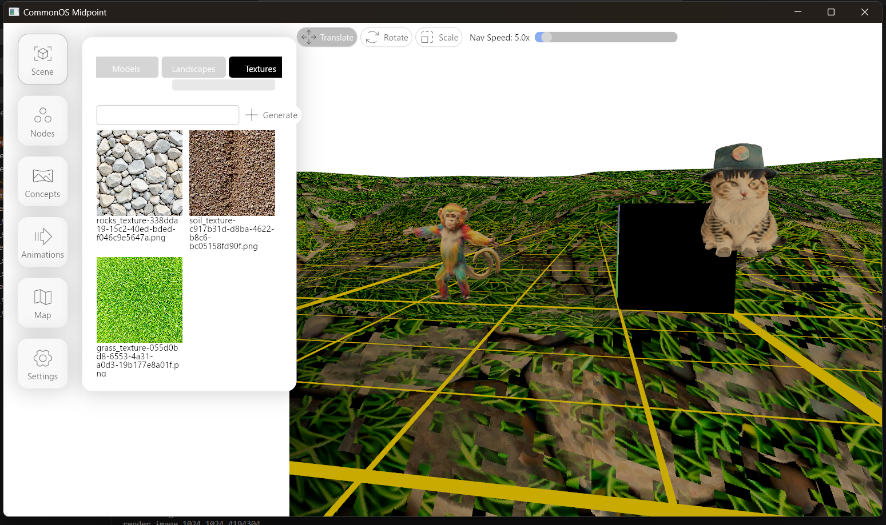

# Midpoint / Rust Game Engine

Vision: Place UX and AI at the center. Generate concepts and textures, then models, then animations, all with full control. Bring your story to life!

- Setup `commonos-server` (Node.js) Used for uploading and generating
- Setup `commonos-files` (Tauri + Vite) Also used for uploading and generating
- Then setup `midpoint-editor` (Rust + Floem + wgpu) Leverages `midpoint-engine` and Floem to implement an editor
